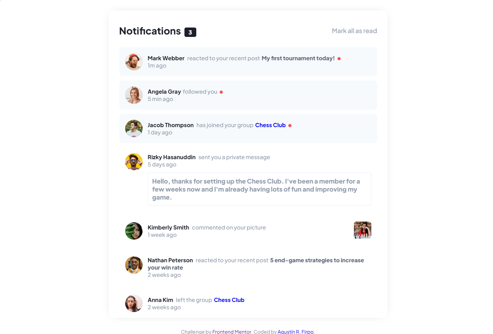
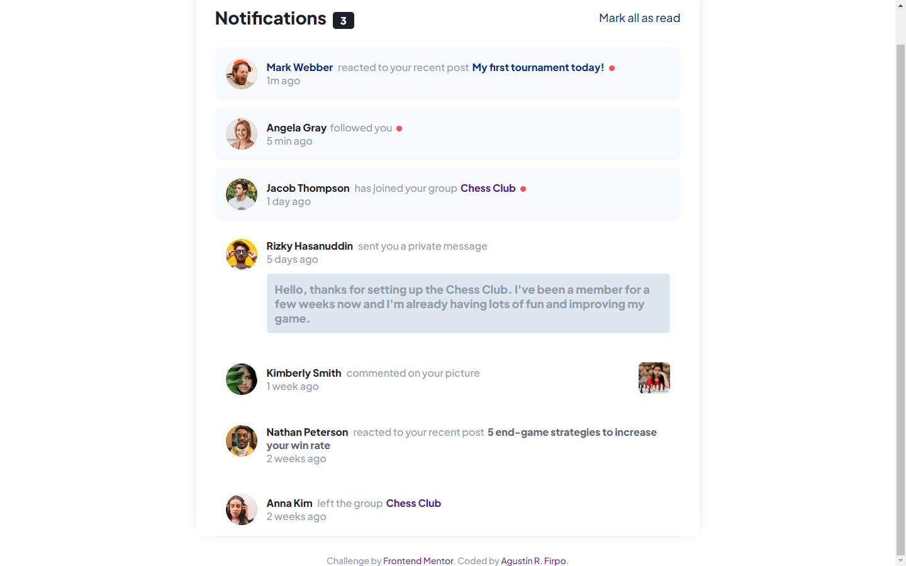
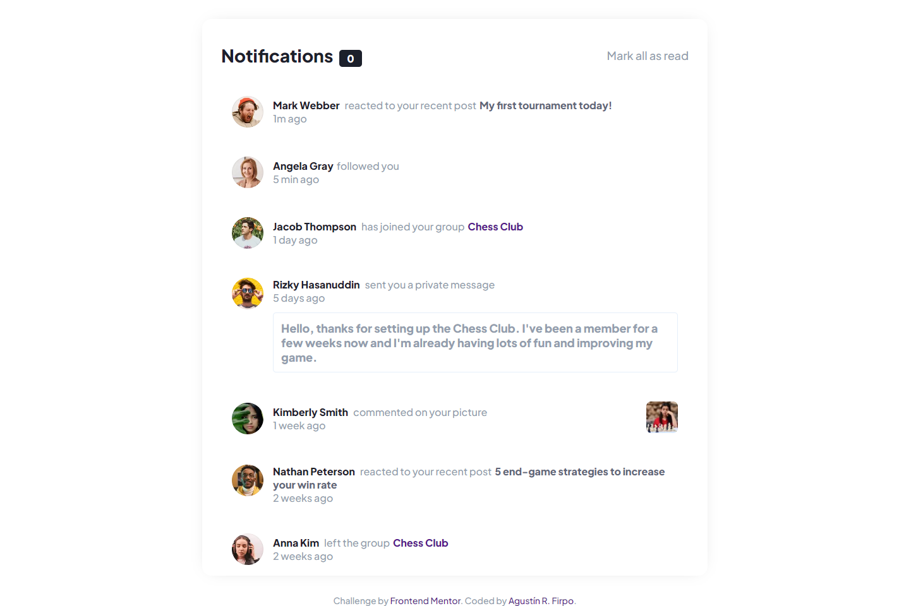
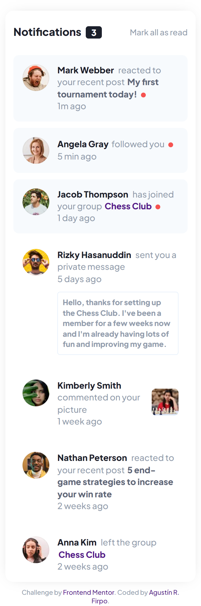

# Frontend Mentor - Notifications page solution

Hi everybody! 👋

This is a solution to the [Notifications page challenge on Frontend Mentor](https://www.frontendmentor.io/challenges/notifications-page-DqK5QAmKbC).

## Table of contents

- [Overview](#overview)
  - [The challenge](#the-challenge)
  - [Screenshot](#screenshot)
  - [Links](#links)
- [My process](#my-process)
  - [Built with](#built-with)
  - [What I learned](#what-i-learned)
- [Author](#author)

## Overview

### The challenge  🎯

Users should be able to:

- Distinguish between "unread" and "read" notifications
- Select "Mark all as read" to toggle the visual state of the unread notifications and set the number of unread messages to zero
- View the optimal layout for the interface depending on their device's screen size
- See hover and focus states for all interactive elements on the page

### Screenshot






### Links  🔗

- [Solution Github Repository](https://github.com/Arfirpo/notifications-page-main)
- [Solution Github Page](https://arfirpo.github.io/notifications-page-main/#)

## My process ⚙️

### Built with  🛠️

- HTML5 markup
- CSS custom properties
- Flexbox
- Javascript

### What I learned 📚

With this challenge I learned how to design a notification bar and fundamentally how to give it the proper functionality so that notifications change from "not read" to "read" status, modifying the notification counter accordingly.

in this fragment we can see the functionality of the "read" button:

```js
const button = document.querySelector('.read');

button.addEventListener('click', () =>{
    document.querySelectorAll('li').forEach(e =>{
        e.classList.remove('unseen');
        console.log(e.classList);
    });
    document.querySelectorAll('.dot').forEach(e =>{
        e.classList.remove('dot');
    })
    document.querySelector('.number').innerText = '0';
    })
```

## Author 🙋🏻‍♂️
- Linkedin - [Agustín Rodrigo Firpo](https://www.linkedin.com/in/agustin-rodrigo-firpo-0aa86697/)
- Frontend Mentor - [@Arfirpo](https://www.frontendmentor.io/profile/Arfirpo)
- X - [@agus_firpo](https://twitter.com/agus_firpo)
